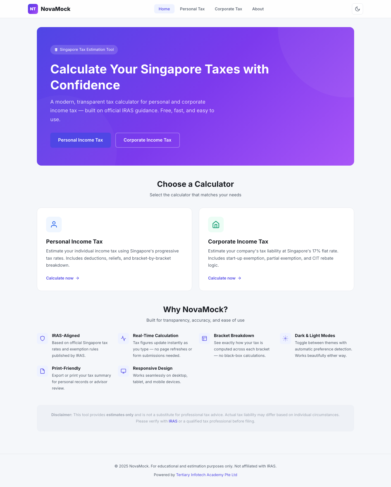

<div align="center">

# NovaMock

[](https://developer.mozilla.org/en-US/docs/Web/HTML)
[](https://developer.mozilla.org/en-US/docs/Web/CSS)
[](https://developer.mozilla.org/en-US/docs/Web/JavaScript)
[](https://alfredang.github.io/novamock/)
[](LICENSE)

**A modern, transparent Singapore tax estimation tool for personal and corporate income tax — based on official IRAS guidance.**

[Live Demo](https://alfredang.github.io/novamock/) · [Report Bug](https://github.com/alfredang/novamock/issues) · [Request Feature](https://github.com/alfredang/novamock/issues)

</div>

## Screenshot



## About

NovaMock is a sleek, dashboard-style web app that helps Singapore residents, professionals, and business owners estimate their personal and corporate income tax. All calculations are based on official IRAS (Inland Revenue Authority of Singapore) progressive tax rates, exemption schemes, and CIT rebate rules.

### Key Features

| Feature | Description |
|---------|-------------|
| **Personal Income Tax** | Progressive bracket calculation for residents (YA 2024–2026), non-resident flat rate support |
| **Corporate Income Tax** | 17% flat rate with Start-Up Tax Exemption (SUTE), Partial Tax Exemption (PTE), and CIT rebate |
| **Real-Time Calculation** | Tax figures update instantly as you type — no page refreshes needed |
| **Bracket Breakdown** | See exactly how your tax is computed across each bracket with tables and bar charts |
| **Dark / Light Theme** | Polished dual-theme with localStorage persistence and auto-detection |
| **Print-Friendly** | Export or print your tax summary for personal records or advisor review |
| **Responsive Design** | Works seamlessly on desktop, tablet, and mobile devices |
| **Privacy First** | All data stays in your browser — no servers, no tracking, no sign-up |
| **Sample Data Loader** | One-click sample data to explore the calculator instantly |
| **localStorage Persistence** | Inputs are saved locally so you can pick up where you left off |

## Tech Stack

| Category | Technology |
|----------|-----------|
| **Markup** | HTML5 |
| **Styling** | CSS3 (custom properties, responsive grid, animations) |
| **Logic** | Vanilla JavaScript (ES6+) |
| **Fonts** | Inter (Google Fonts) |
| **Hosting** | GitHub Pages |
| **Tax Data** | IRAS official progressive rates and CIT rules |

## Architecture

```
┌──────────────────────────────────────────────┐
│                   Browser                     │
├──────────────────────────────────────────────┤
│  ┌──────────┐  ┌──────────┐  ┌──────────┐   │
│  │  index   │  │ personal │  │corporate │   │
│  │  .html   │  │ -tax.html│  │-tax.html │   │
│  └────┬─────┘  └────┬─────┘  └────┬─────┘   │
│       │              │              │         │
│  ┌────▼──────────────▼──────────────▼─────┐  │
│  │          css/styles.css                │  │
│  │     (themes, responsive, components)   │  │
│  └────────────────────────────────────────┘  │
│                                              │
│  ┌────────────────────────────────────────┐  │
│  │  js/common.js    │  js/theme.js        │  │
│  │  (utils, format) │  (dark/light toggle)│  │
│  └─────────┬────────┴────────┬────────────┘  │
│            │                 │                │
│  ┌─────────▼─────┐  ┌───────▼──────────┐    │
│  │ personal-tax  │  │  corporate-tax   │    │
│  │    .js        │  │      .js         │    │
│  └───────┬───────┘  └───────┬──────────┘    │
│          │                  │                │
│  ┌───────▼──────────────────▼──────────┐    │
│  │      js/data/tax-rates.js           │    │
│  │  (IRAS brackets, exemptions, CIT)   │    │
│  └─────────────────────────────────────┘    │
└──────────────────────────────────────────────┘
```

## Project Structure

```
novamock/
├── index.html              # Landing page with hero and calculator cards
├── personal-tax.html       # Personal income tax calculator
├── corporate-tax.html      # Corporate income tax calculator
├── about.html              # Tax rules, FAQ, and feature summary
├── css/
│   └── styles.css          # Complete theme system (dark/light), responsive layout
├── js/
│   ├── common.js           # Shared utilities (currency format, validation, localStorage)
│   ├── theme.js            # Dark/light mode toggle with persistence
│   ├── personal-tax.js     # Personal tax calculation engine
│   ├── corporate-tax.js    # Corporate tax calculation engine
│   └── data/
│       └── tax-rates.js    # IRAS tax brackets, exemptions, and CIT rebate data
├── assets/
│   └── screenshot.png      # App screenshot
├── screenshot.png          # README screenshot
└── README.md
```

## Getting Started

### Prerequisites

- A modern web browser (Chrome, Firefox, Safari, Edge)
- No build tools, frameworks, or server required

### Installation

1. **Clone the repository**
   ```bash
   git clone https://github.com/alfredang/novamock.git
   cd novamock
   ```

2. **Open in browser**
   ```bash
   open index.html
   ```
   Or simply double-click `index.html` in your file explorer.

### Running Locally

No server needed — just open `index.html` directly in your browser. All pages link to each other via relative paths.

For a local development server (optional):
```bash
npx serve .
```

## Deployment

### GitHub Pages

This project is deployed automatically via GitHub Actions. Every push to `main` triggers a deployment to:

**https://alfredang.github.io/novamock/**

### Manual Deployment

Since this is a static site, you can deploy it anywhere:
- Drag and drop the folder to **Netlify**
- Upload to any **static hosting** provider
- Serve from **any web server** (Apache, Nginx, etc.)

## Contributing

Contributions are welcome! Here's how:

1. **Fork** the repository
2. **Create** a feature branch (`git checkout -b feature/amazing-feature`)
3. **Commit** your changes (`git commit -m 'Add amazing feature'`)
4. **Push** to the branch (`git push origin feature/amazing-feature`)
5. **Open** a Pull Request

## Developed By

<div align="center">

**[Tertiary Infotech Academy Pte Ltd](https://www.tertiarycourses.com.sg/)**

</div>

## Acknowledgements

- [IRAS](https://www.iras.gov.sg/) — Official Singapore tax rates and guidance
- [Inter Font](https://rsms.me/inter/) — Clean, modern typeface by Rasmus Andersson
- [Shields.io](https://shields.io/) — Badges for the README

---

<div align="center">

If you found this useful, please consider giving it a ⭐

</div>
